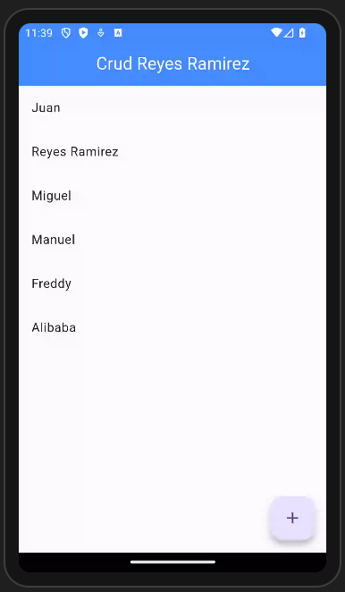
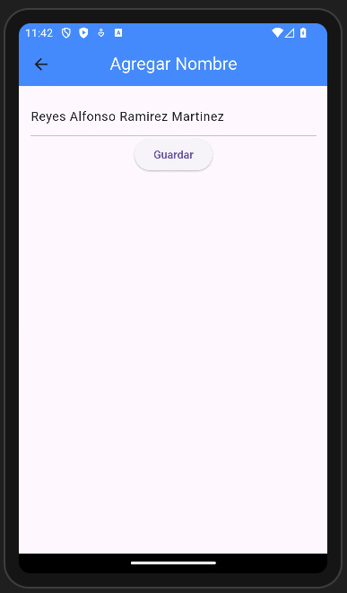
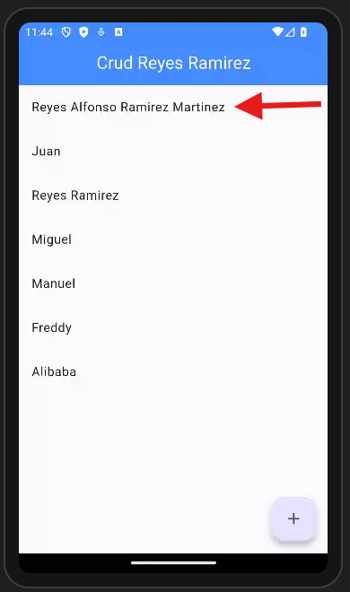
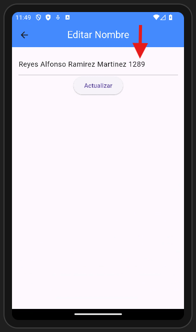
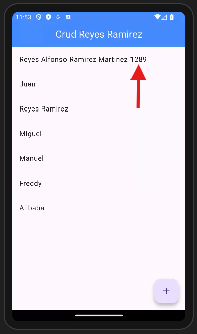
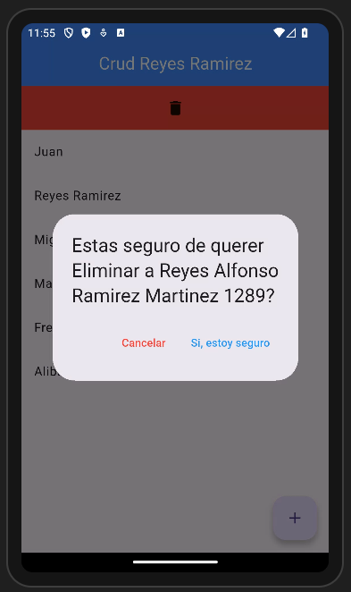
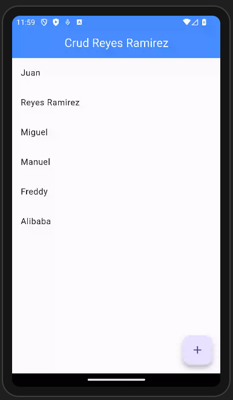
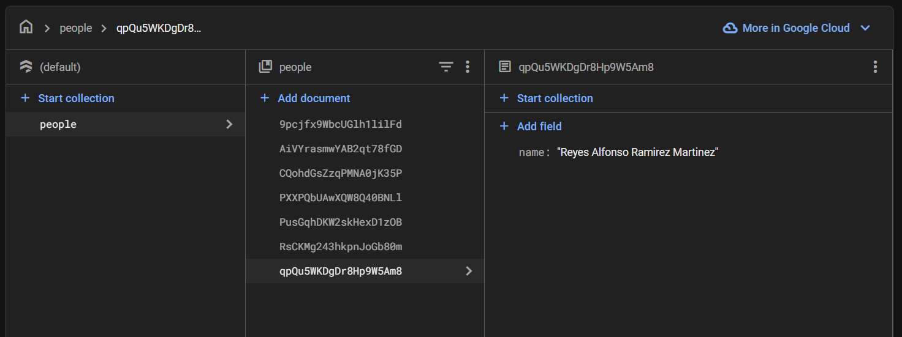
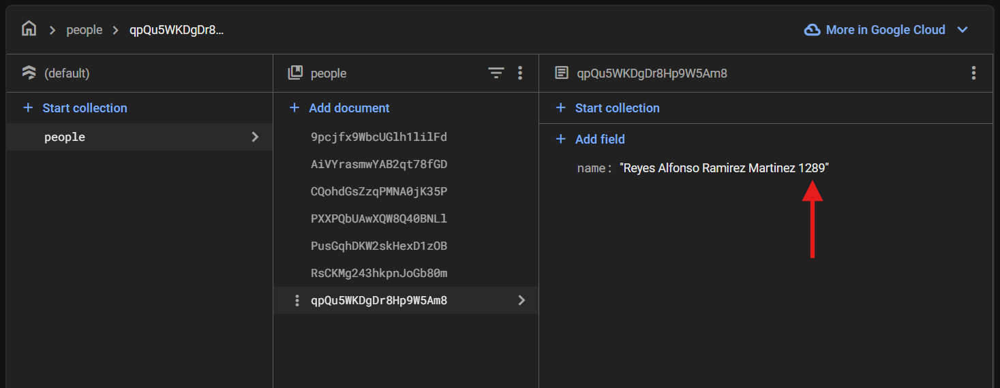
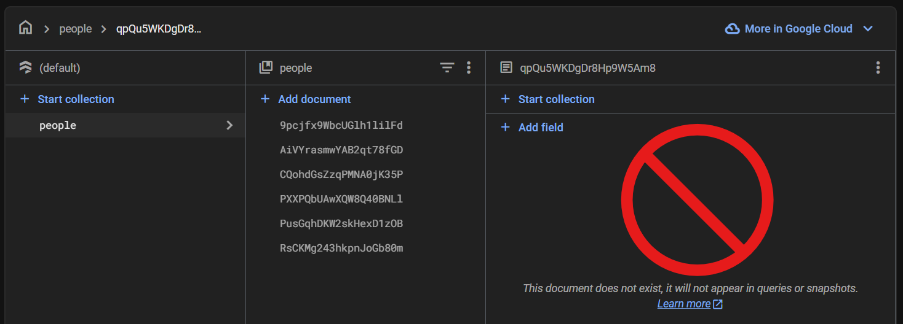

# myapp

- Pagina de inicio

- Pagina para agregar

- Pagina actualizada

- Pagina para editar

- Pagina actualizada 2

- Opcion para eliminar

- Pagina actualizada 3

- Base de datos

- Base de datos actualizada

- Base de datos actualizada 2

